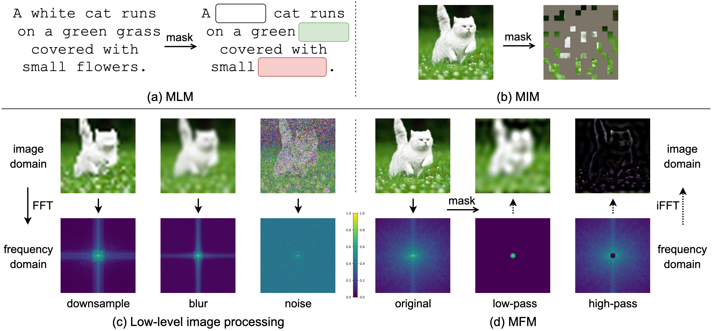

# Masked Frequency Modeling for Self-Supervised Visual Pre-Training

## Introduction

This repository contains the official PyTorch implementation of the following paper:

> [**Masked Frequency Modeling for Self-Supervised Visual Pre-Training**](https://arxiv.org/abs/2206.07706),  
> Jiahao Xie, Wei Li, Xiaohang Zhan, Ziwei Liu, Yew Soon Ong, Chen Change Loy  
> In: International Conference on Learning Representations (ICLR), 2023  
> [[arXiv](https://arxiv.org/abs/2206.07706)][[Project Page](https://www.mmlab-ntu.com/project/mfm/index.html)][[Bibtex](https://github.com/Jiahao000/MFM#citation)]



## Updates

- [04/2023] Code and models of SR, Deblur, Denoise and MFM are released.

## Models

### ViT

**ImageNet-1K Pre-trained and Fine-tuned Models**

| Method  | Backbone | Pre-train epochs | Fine-tune epochs | Top-1 acc (%) | Pre-trained model | Fine-tuned model |
|---------|:--------:|:----------------:|:----------------:|:-------------:|:-----------------:|:----------------:|
| SR      | ViT-B/16 |        300       |        100       |      82.4     |[config](configs/vit_base/sr_pretrain__vit_base__img224__300ep.yaml) &#124; [model](https://drive.google.com/file/d/1NvysdzymzbuIT5BlhczLy5qZJ7wL4dbO/view?usp=sharing)|[config](configs/vit_base/finetune__vit_base__img224__100ep.yaml) &#124; [model](https://drive.google.com/file/d/12a7w7t0weJO2wpuMYfFn0DTwYCk5DK1o/view?usp=sharing)|
| Deblur  | ViT-B/16 |        300       |        100       |      81.7     |[config](configs/vit_base/deblur_pretrain__vit_base__img224__300ep.yaml) &#124; [model](https://drive.google.com/file/d/1dvKolr_Xgp-eNwlHmzl0aULofknnOshS/view?usp=sharing)|[config](configs/vit_base/finetune__vit_base__img224__100ep.yaml) &#124; [model](https://drive.google.com/file/d/1mK7ViXL_o3bRVHR21zvSFdkU-iuWBlmy/view?usp=sharing)|
| Denoise | ViT-B/16 |        300       |        100       |      82.7     |[config](configs/vit_base/denoise_pretrain__vit_base__img224__300ep.yaml) &#124; [model](https://drive.google.com/file/d/1gfyWJEeK-7iBI64YRGTE_Lna_gzTs8rG/view?usp=sharing)|[config](configs/vit_base/finetune__vit_base__img224__100ep.yaml) &#124; [model](https://drive.google.com/file/d/1CAv-a_75S-7p0jaiWUDv2ZSo1QYcVcSR/view?usp=sharing)|
| MFM     | ViT-B/16 |        300       |        100       |      83.1     |[config](configs/vit_base/mfm_pretrain__vit_base__img224__300ep.yaml) &#124; [model](https://drive.google.com/file/d/1qgMuODAxAapwXZXbH2Bgo5s5O_zc1bdl/view?usp=sharing)|[config](configs/vit_base/finetune__vit_base__img224__100ep.yaml) &#124; [model](https://drive.google.com/file/d/1uxYn_q3BA0J5XlUMSnf8c2uQfLA0bkJo/view?usp=sharing)|

### CNN

**ImageNet-1K Pre-trained and Fine-tuned Models**

| Method  | Backbone  | Pre-train epochs | Fine-tune epochs | Top-1 acc (%) | Pre-trained model | Fine-tuned model |
|---------|:---------:|:----------------:|:----------------:|:-------------:|:-----------------:|:----------------:|
| SR      | ResNet-50 |        300       |        100       |      77.9     |[config](configs/resnet50/sr_pretrain__resnet50__img224__300ep.yaml) &#124; [model](https://drive.google.com/file/d/1_rpcvWJt3yHQYHdE3m5mCldUGH1S73EI/view?usp=sharing)|[config](https://github.com/huggingface/pytorch-image-models) &#124; [model](https://drive.google.com/file/d/1hIdAApYD7sVb-qf3WA_3KaJMCJKUk25T/view?usp=sharing)|
| Deblur  | ResNet-50 |        300       |        100       |      78.0     |[config](configs/resnet50/deblur_pretrain__resnet50__img224__300ep.yaml) &#124; [model](https://drive.google.com/file/d/174Bcn-oPm6IB9h6RDB8Ujkr92tRC_vqK/view?usp=sharing)|[config](https://github.com/huggingface/pytorch-image-models) &#124; [model](https://drive.google.com/file/d/1ThCmH-Vmh9S6PBuXrv5XAMY04mpOAqJ1/view?usp=sharing)|
| Denoise | ResNet-50 |        300       |        100       |      77.5     |[config](configs/resnet50/denoise_pretrain__resnet50__img224__300ep.yaml) &#124; [model](https://drive.google.com/file/d/18MulyHunviyRrSIJFJhp8bfcamjr55-w/view?usp=sharing)|[config](https://github.com/huggingface/pytorch-image-models) &#124; [model](https://drive.google.com/file/d/18v7RrSsJp1lxXeKaZczuwUmm0OY59HJf/view?usp=sharing)|
| MFM     | ResNet-50 |        300       |        100       |      78.5     |[config](configs/resnet50/mfm_pretrain__resnet50__img224__300ep.yaml) &#124; [model](https://drive.google.com/file/d/1rWXMJryJ2tq44EYfkZ8GREQoYLf1up9e/view?usp=sharing)|[config](https://github.com/huggingface/pytorch-image-models) &#124; [model](https://drive.google.com/file/d/1qr_kMb7bDEP1hwYD-bJ5mG7Co7KYlQSq/view?usp=sharing)|
| MFM     | ResNet-50 |        300       |        300       |      80.1     |[config](configs/resnet50/mfm_pretrain__resnet50__img224__300ep.yaml) &#124; [model](https://drive.google.com/file/d/1rWXMJryJ2tq44EYfkZ8GREQoYLf1up9e/view?usp=sharing)|[config](https://github.com/huggingface/pytorch-image-models) &#124; [model](https://drive.google.com/file/d/1Uftl6c33gngKzWEj2c9ewmWGFBvGYgMo/view?usp=sharing)|

## Installation

Please refer to [INSTALL.md](docs/INSTALL.md) for installation and dataset preparation.

## Pre-training

Please refer to [PRETRAIN.md](docs/PRETRAIN.md) for the pre-training instruction.

## Fine-tuning

Please refer to [FINETUNE.md](docs/FINETUNE.md) for the fine-tuning instruction.

## Citation

If you find our work useful for your research, please consider giving a star :star: and citation :beer::

```bibtex
@inproceedings{xie2023masked,
  title={Masked Frequency Modeling for Self-Supervised Visual Pre-Training},
  author={Xie, Jiahao and Li, Wei and Zhan, Xiaohang and Liu, Ziwei and Ong, Yew Soon and Loy, Chen Change},
  booktitle={ICLR},
  year={2023}
}
```

## Acknowledgement

This code is built using the [timm](https://github.com/huggingface/pytorch-image-models) library, the [BEiT](https://github.com/microsoft/unilm/tree/master/beit) repository and the [SimMIM](https://github.com/microsoft/SimMIM) repository.
